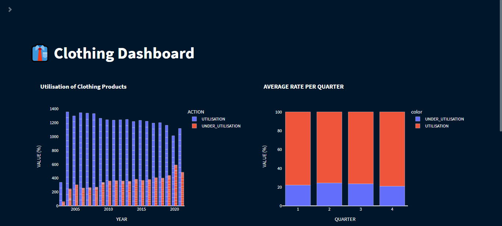
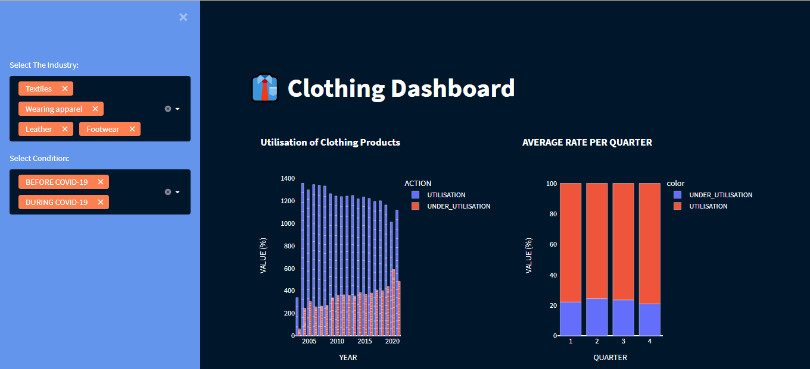
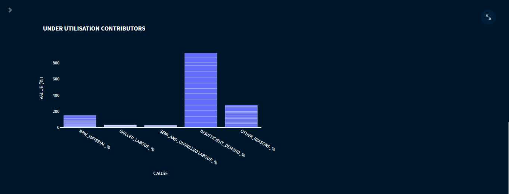

# Clothing Dashbord
## Overview
The data was downloaded from statssa, the original dataset includes stats on how industries utilised their manufactured products every quarter each year since 2003 in the fourth quarter. This dashboard only includes textiles, leather, footwear and wearing apparel industries.
## Libraries
The libraries used in this project are python libraries i.e.:
- Pandas (Mainly used to clean the data)
- Plotly-express (Used for visualisation)
- Streamlit (Make the dashboard accessible online)
 

